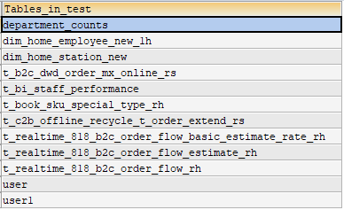
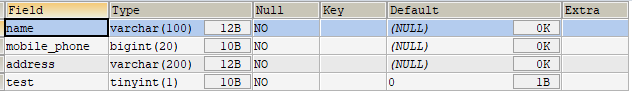
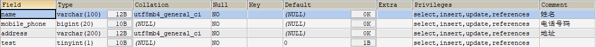

# Mysql 获取表信息

### 获取表名

``` sql
-- 使用show tables就可以看到当前数据库下边的所有的数据表
SHOW TABLES;
```



### 获取字段

``` sql
-- 使用desc xxx即可查看表的详细结构，包含字段的全部信息。
DESC table_name;
```



### 获取字段全信息

``` sql
-- 查看包含注释等额外的全部字段
SHOW FULL COLUMNS FROM table_name;
```


